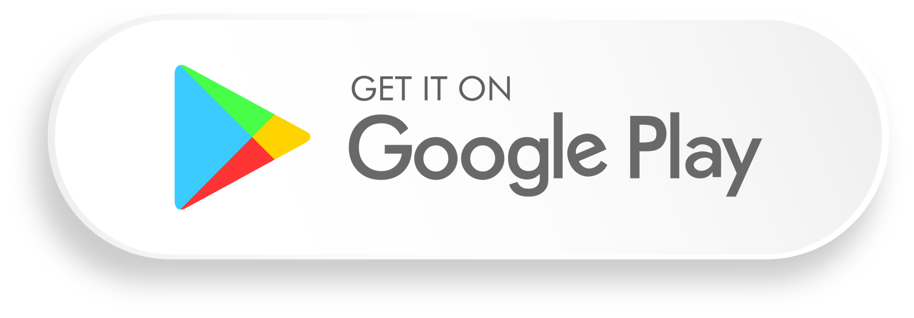

 

<h3 align="center">ZSEL GPS</h3>

Aplikacja mobilna stworzona z myślą o nowych uczniach Zespołu Szkół Elektrycznych we Włocławku, aby pomóc im w nawigacji po szkole i uniknięciu gubienia się w jej budynku.
 
 

 
<a href="#"><strong>Zobacz dokumentację »</strong></a>
 
 
<a href="#">Zgłoś błąd</a>

  
 

## Spis treści

- [Funkcje aplikacji](#Funkcje-aplikacji)
- [Instalacja](#Instalacja)
- [Technologie](#Technologie)
- [Wersja](#Wersja)
- [Plany na przyszłość](#Plany-na-przyszłość)
- [Autorzy](#Autorzy)

### Funkcje aplikacji

- Nawigacja wewnątrz szkoły: Pomaga nowym uczniom odnaleźć drogę w budynku szkoły.
- Prosta i intuicyjna obsługa: Interfejs użytkownika został zaprojektowany tak, aby był łatwy do zrozumienia i użycia.
- Dostępna dla uczniów: Aplikacja jest dedykowana społeczności Zespołu Szkół Elektrycznych we Włocławku.

### Instalacja

Aktualną wersję beta aplikacji możesz pobrać bezpośrednio z naszego serwera szkolnego: Pobierz ZSEL GPS.

Wersja na Google Play pojawi się wkrótce.

### Technologie 
  

- Unity: Silnik do tworzenia gier i aplikacji mobilnych.
- C#: Język programowania użyty do implementacji logiki aplikacji.
- Android: Platforma, na której aplikacja jest uruchamiana.

### Wersja

Aplikacja znajduje się w wersji beta (0.0.3), co oznacza, że może zawierać błędy i niedociągnięcia. Pracujemy nad poprawą jej funkcjonalności oraz stabilnością przed oficjalnym wydaniem na Google Play.

### Plany na przyszłość
- Publikacja aplikacji na Google Play.
- Dodanie nowych funkcji i usprawnień.
- Udoskonalenie nawigacji i mapy szkolnej.

### Autorzy 

ZSEL GPS został stworzony przez Patryka Pietrzyka, oraz Martę Błaszczyk (uczniów szkoły Zespołu Szkół Elektrycznych we Włocławku).

